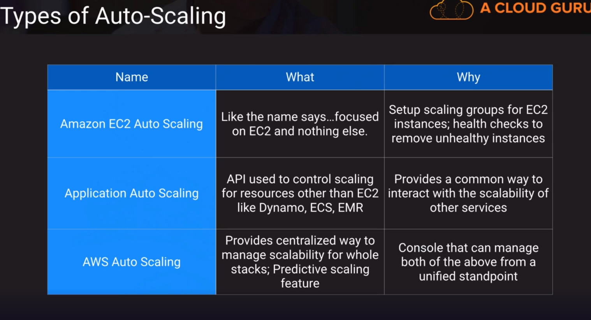
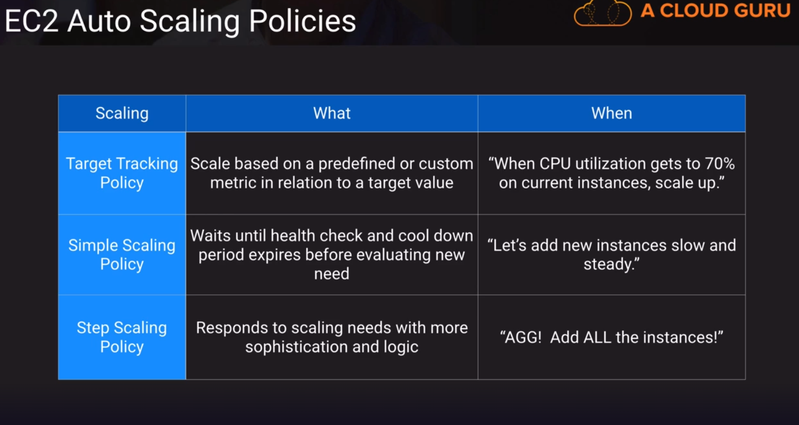

### Architecting to scale

- Design for New Solutions
    
        Autoscaling policies and events
        Application integration ( SNS,SQS,Step Functions)
        Service quotas and limits
        Performance monitoring technologies

- Continuous Improvement for Existing Solutions.

        Monitoring and logging solutions
        High-performing system architectures
        Identifying and examining perfomance bottlenecks
        Scaling methodologies.

- Accelerate Workload Migration and Modernization

        Containers (ECS,EKS,Fargate,ECR)
        Serverless compute offerings (AWS Lambda)
        Integration Service(SQS,SNS,EventBridge,Step Functions)

### EC2 AutoScaling Policies

Default cooldown period is 300 seconds
not supported for scheduled scaling.

### Scaling containers

- Control and Complexity

      High Control/ High complexity (overhead)
      non-managed services ( eks )

      ECS (mid control/mid complexity)

      Fargate (low control/low complexity)

      App Runner (low control/low complexity)

 service
      Create and publish interactive dashboards
      Pay-per-session pricing model
      Data Sources:
      - Amazon Athena
      - Amazon Aurora
      - Amazon OpenSearch
      - Amazon Redshift
      - Amazon S3
      - Amazon RDS
      - AWS Iot Analytics
      - Amazon Timestream
      - MySQL,Spark,PostgreSQL,SQL Server,Oracle,Presto,MariaDB,Exasol
      - Third-party data sources (Salesforce, Twitter, etc)

### Difference between healthceck grace and cooldown period

- Healthcheck grace period

      The amount of time that Amazon EC2 Auto Scaling waits before checking the health status of an EC2 instance that has come into service.
      The grace period begins when the instance passes the EC2 status checks.
      During the grace period, Amazon EC2 Auto Scaling does not move on to the next policy that is triggered by the CloudWatch alarm.
      The default is 300 seconds.

### Difference between desired,min and max instances

- Desired capacity

      The number of Amazon EC2 instances that should be running in the group.
      The desired capacity must be greater than or equal to the minimum size 
      and less than or equal to the maximum size of the group.

- Minimum capacity

      The minimum number of Amazon EC2 instances that the Auto Scaling group can have.
      This number must be greater than or equal to 0.

- Maximum capacity

      The maximum number of Amazon EC2 instances that the Auto Scaling group can have.
      This number must be greater than or equal to the minimum size of the group and less than or equal to 40.
