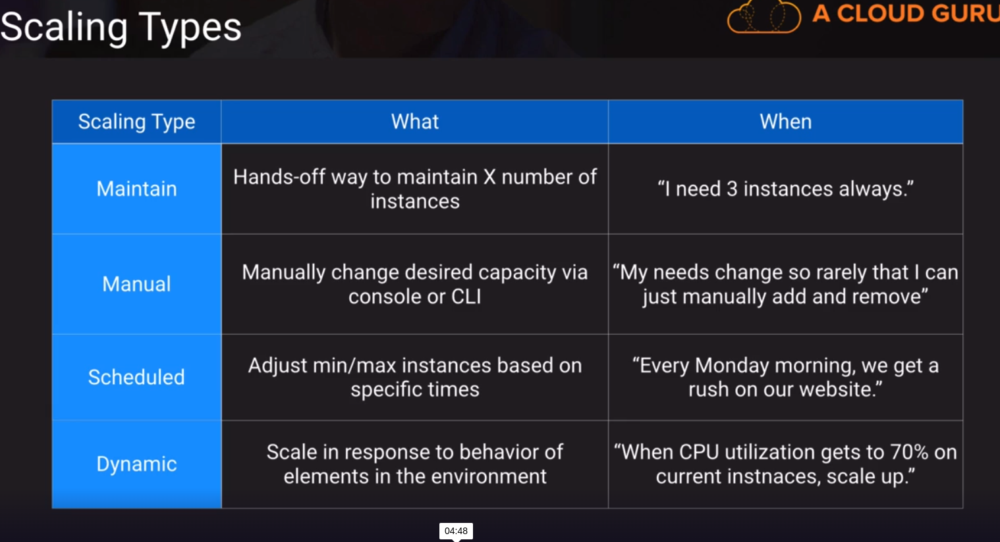

### Architecting to scale

- Design for New Solutions
    
        Autoscaling policies and events
        Application integration ( SNS,SQS,Step Functions)
        Service quotas and limits
        Performance monitoring technologies

- Continuous Improvement for Existing Solutions.

        Monitoring and logging solutions
        High-performing system architectures
        Identifying and examining perfomance bottlenecks
        Scaling methodologies.

- Accelerate Workload Migration and Modernization

        Containers (ECS,EKS,Fargate,ECR)
        Serverless compute offerings (AWS Lambda)
        Integration Service(SQS,SNS,EventBridge,Step Functions)

### EC2 AutoScaling Policies

Default cooldown period is 300 seconds
not supported for scheduled scaling.

### Scaling containers

- Control and Complexity

      High Control/ High complexity (overhead)
      non-managed services ( eks )

      ECS (mid control/mid complexity)

      Fargate (low control/low complexity)

      App Runner (low control/low complexity)

 service
      Create and publish interactive dashboards
      Pay-per-session pricing model
      Data Sources:
      - Amazon Athena
      - Amazon Aurora
      - Amazon OpenSearch
      - Amazon Redshift
      - Amazon S3
      - Amazon RDS
      - AWS Iot Analytics
      - Amazon Timestream
      - MySQL,Spark,PostgreSQL,SQL Server,Oracle,Presto,MariaDB,Exasol
      - Third-party data sources (Salesforce, Twitter, etc)

