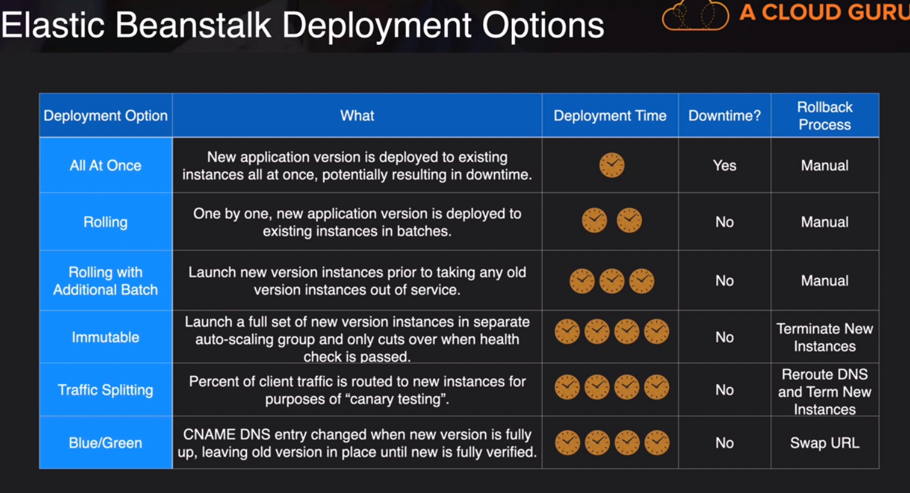

### Deployments and Operations

- Design for New Solutions

      Infraestucture as code
      Continuous integration/ delivery
      Configuration management tools
    
- Continuous Improvement for Existing Solutions
    
      Improve CI/CD
      Configuration management tools

- Accelerate Workload Migration and Modernization

      Portfolio assessment
      Prioritization and migration of workloads.

### Types of Deployments

- All at once

      - Deploy all the instances at the same time
      - Fastest deployment
      - Downtime

- Rolling

      - Deploy instances in batches
      - No downtime
      - Slowest deployment

- Blue/Green
    
        - Deploy new instances alongside the old ones
        - No downtime
        - Fast deployment

### Code Commit

    AWS-Managed Git repositories

### Code Pipeline

    Continuous delivery service for fast and reliable application updates
    
### Code Build

    Fully managed build service that compiles source code, runs tests, and produces software packages that are ready to deploy

### Code Deploy

    Automates code deployments to any instance, including EC2 instances and instances running on-premises

### AWS OpsWorks

    Chef and Puppet

