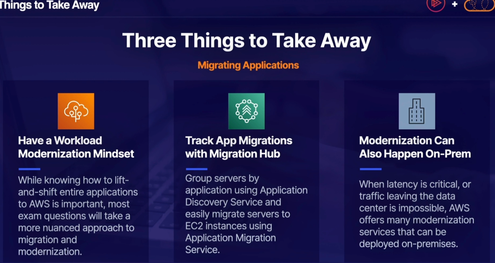

### Migrations

#### Migrations strategies

-Re-Host

    Lift and shift Move on-prem Mysql database to ec2

-Re-Platform

    Lift and Reshape
    Migrate on-prem Mysql to RDS

-Re-Purchase

    Abandon existing and purchase new
    Migrate on-prem CRM to salesforce

-Rearchitect
    
    Redesign application in a cloud-native manner
    Create a serverless-versions of legacy

-Retire
    
    Get rid of it

-Retain
    
    Keep it as is

### Application Migration Service

Could be used for migrate from one region to another region

### AWS Outposts

AWS Outposts is a fully managed service that extends AWS infrastructure, 
AWS services, APIs, and tools to virtually
any datacenter, co-location space, or on-premises facility 
for a truly consistent hybrid experience.

### AWS Snow Family

- Snowball Edge : 100TB
- Snowcone: 8TB
- Snowmobile: 100PB
- Snowball Edge Storage Optimized: 80TB to 210TB
- Snowball Edge Compute Optimized: 42TB to 168TB

### Transfer Family

From to S3 and EFS
Protocol: FTP, FTPS, SFTP, and AWS S3
