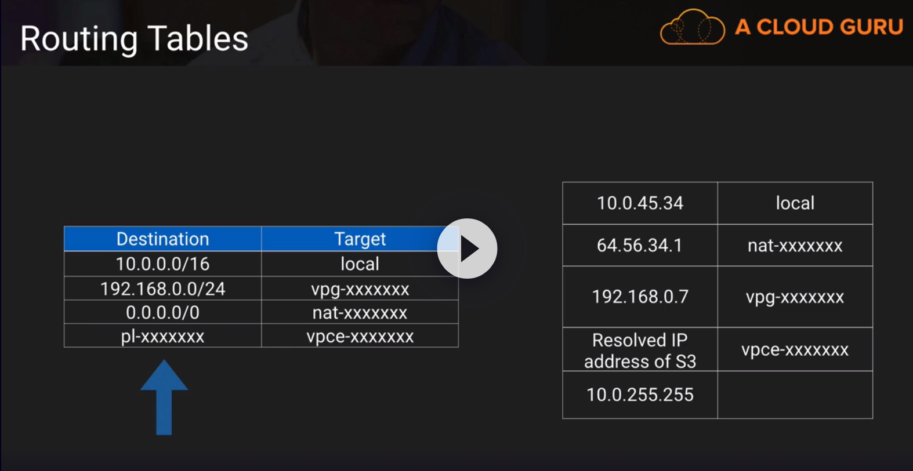
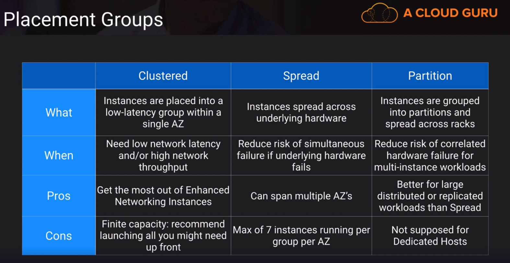
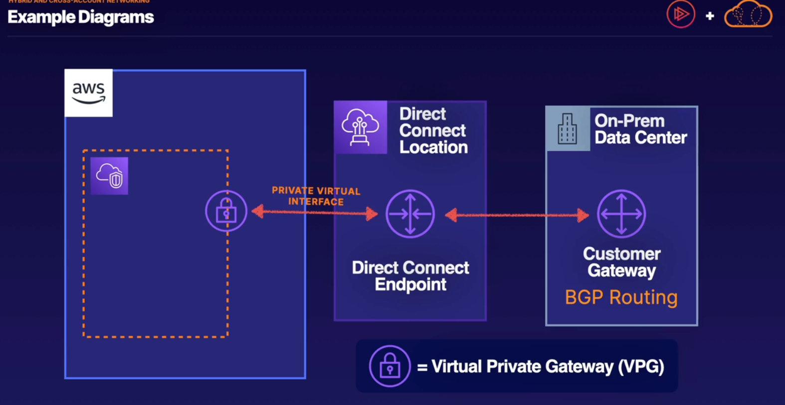
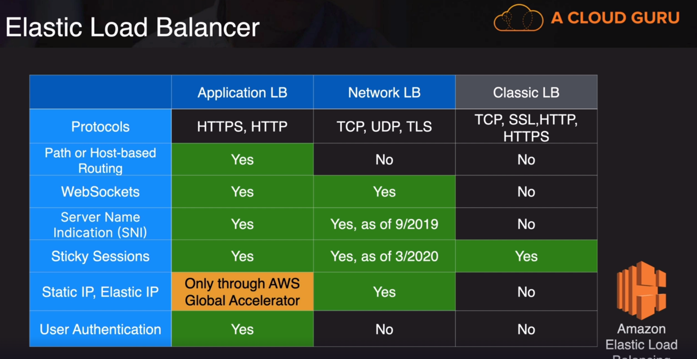

### Route Table

- VPC does not support broadcast.

### Border Gateway Protocol (BGP)

- Popular routing protocol for the internet.
- Propagates information about the network to allow for dynamic routing.
- Required for Direct Connect and optional for VPN.
- Alternative of not using BGP with AWS VPC is static routes
- BGP is a path vector protocol, which means that the BGP router keeps a list of network prefixes that can be reached and the path to reach them.
- Autonomous System Number (ASN) is a globally unique number that is used to identify an autonomous 
system and which enables that system to exchange exterior routing information with other neighboring autonomous systems.

### Enhanced Networking

- Generally used for High Performance Computing use-cases.
- Elastic Network Adapter 25 Gbps
- Intel 82599 VF interface 10 Gbps

### Placement groups

Placement Group for cluster:  can span multiple AZ's
Need low network latency and high network throughput
Finite capacity

Placement Group for spread:  can span multiple AZ's
Reduce risk of simultaneous failures if underlying hadware fails 
or if a single AZ goes down

Placement Group for partition: Better for large distributed and replicated workloads
Reduce risk of correlated hardware failure for multi-instance
workloads.
Not supported dedicated hosts

### Hybrid and Cross-Account

- Direct Connect
- Site-to-Site VPN
- Establishing High Availability

### Direct Connect

A private Route from ON-Premises to the cloud
AWS Connect sits global network to your global center.
Great for frequent transfer of large data sets.

(requires BGP)

### Site-to-Site VPN

The fastest way to connect on-prem to th ecloud

- Secure, fully managed connection using IPSEs tunnels
- Connect directly to VPC'sor to transit gateways
- Two tunnels per VPN connection for redundancy

### Establishing High Availability

- One single Point of fail is Direct Connect,You could add a second vpn.

- Ideally you would have two Direct Connects and two VPNs

### To remember for the exam

| Direct Connect                                                                                                    |Site-to-site VPN| Transit Gateway|
|-------------------------------------------------------------------------------------------------------------------|----------------|----------------|
| Bypasses the internet, provides the most secure route to AWS Cloud,but it can be expensive and take weeks | Are limitedby your ISP,the fastest way to connect | Transist gateway make multi-region multi VPC, multi connection and multi account network much easier, providing scalable networking hub|

### PrivateLink

Securely connect to VPC Endpoints
Control the API endpoints, sites, and services
that your VPC endpoint can access
PrivateLink uses interface VPC endpoints

### To remember for the exam

- Connect with services outside of your vpc
- Dozens of native service integrations
- Many marketplace solutions are compatible

### Global Accelerator

- What is it?
Move AWS Endpoints closer to your users

- How does it work?
Gives static public IP addresses that act 
as a fixed entry point to your application
endpoints in a single or multiple AWS Regions, 
such as your Application Load Balancers,
Network Load Balancers or Amazon EC2 instances.

### To remember for the exam

- Global Accelerator can improve latency up to 60%
- Multi-Region Routing and Failover
- Static IP addresses

### Route53

Dns record types
- A
- CNAME
- AAAA
- MX
- NS
- PTR
- SOA
- SRV
- TXT

### Routing policies

| Policy |  Route53 is thinking |
|--------|----------------------|
| Simple |  One record with multiple IP addresses |
| Weighted |  Route traffic to multiple resources in proportions that you specify |
| Latency |  Route traffic based on the lowest network latency for your end user |
| Failover |  Route traffic to a resource when the resource is healthy or to a different resource when the first resource is unhealthy |
| Geolocation |  Route traffic based on the location of your users |
| Multivalue answer |  Route traffic to multiple resources, such as web servers, in multiple AWS Regions |
| Geoproximity |  Route traffic based on the geographic location of your users and your resources |

### To remember for the exam

- A Hosted ZOne is a collection of records
- Multiple accounts help with security and visibility.

### CloudFront

Distributed content delivery network (CDN)
Supports SNi and SSLv3

### Elastic Load Balancer

 Three differents load balancer
  - Application Load Balancer (Layer 7)
  - Network Load Balancer (Layer 4)
  - Classic Load Balancer (Layer 4 and Layer 7)
  - Can be use for public and private workloads.
  - Consume IP addresses within your VPC

### Pro Tips

- Explicit deny for NaCLs

