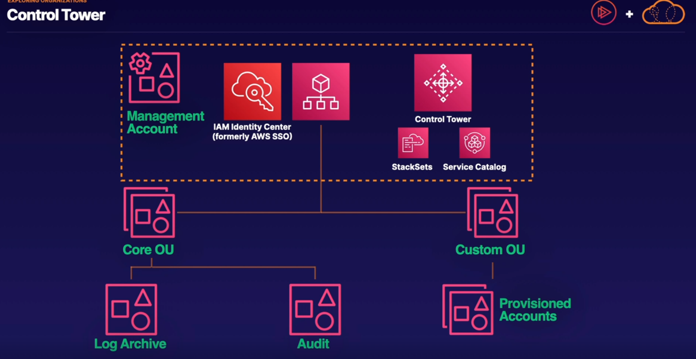
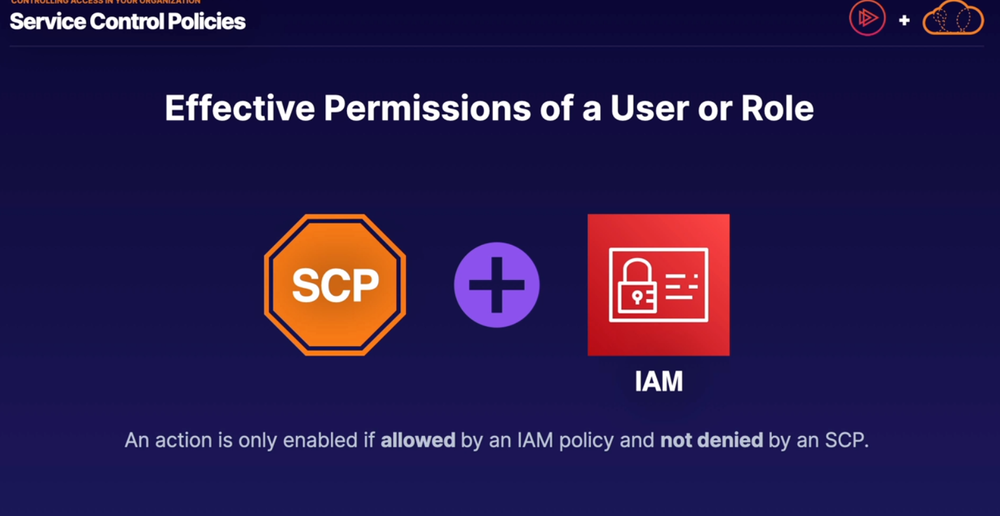
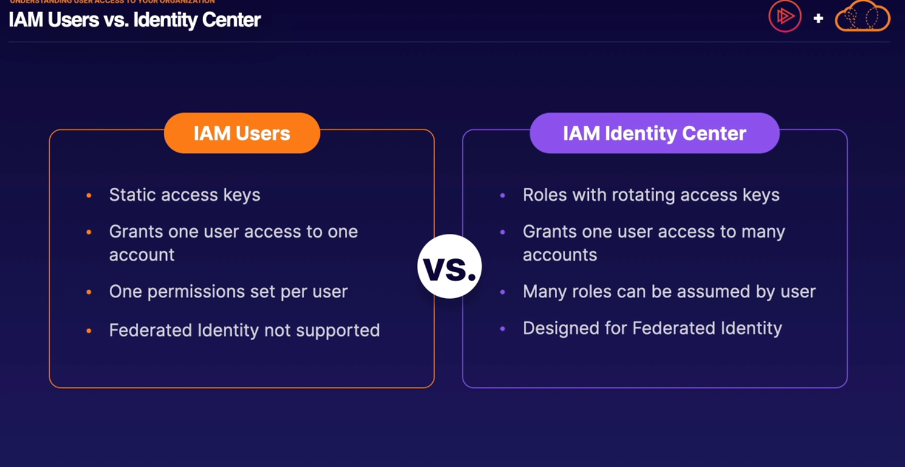
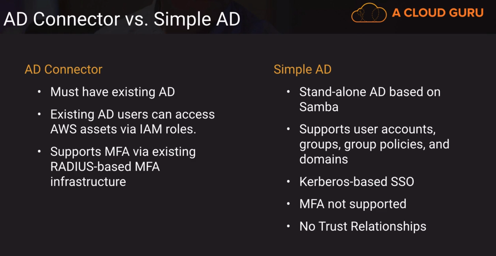
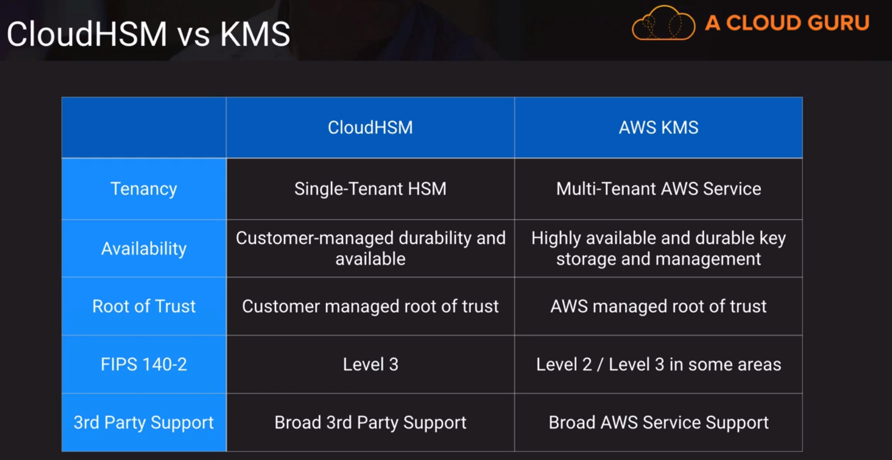
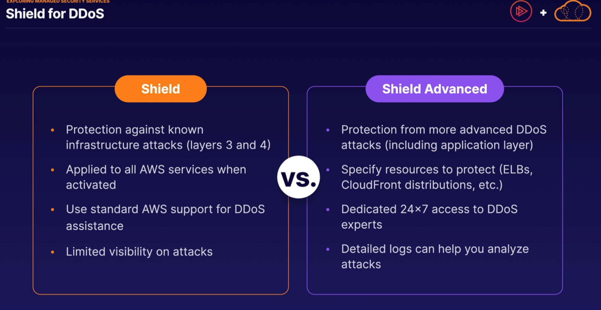
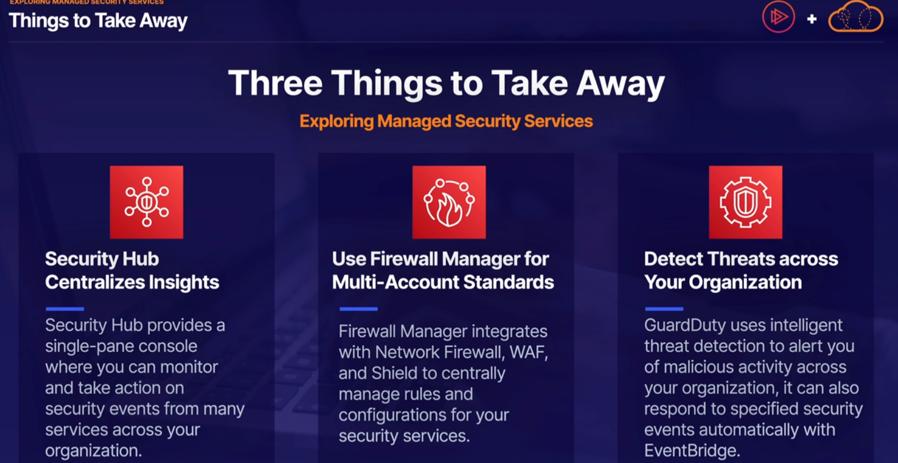

## Security

### Anatomy of Organizations

- Organizational Units (OU)
- Accounts
- Service Control Policies (SCP)

### Key terms for AWS Control Tower

- Landing Zone: What you provision when you start using Control Tower
- Guardrails: Rules that govern your AWS environment
- Baseline: A set of guardrails that are enabled by default

### To remember for the exam

- Group your workloads with AWS Organizations
- Only Allow Access When Needed
- Automate Best Practices with Control Tower.

AWS Config

Monitoring Best Practices across your organizations

Disover noncompliant resources that require action
Keep a history of actions that caused noncompliance

IAM Identity Center (Formerly AWS SSO)
Integrates with identity providers 
AWS SSO can also act as an independent user directory.

### Types of Directory Services Offered

|Directory Service Option | Description                                                                                             | Best for                                                                 | 
|-------------------------|---------------------------------------------------------------------------------------------------------|--------------------------------------------------------------------------|
| AWS Cloud Directory | Cloud-native directory to share and control  access to  hierarchical data between applications  | Cloud application that need hierarchical data with complex relationships |
| Amazon Cognito | Sign-up and sign-in functionality that scales to millons of users and federated to public social medias | Develop consumer apps or SaaS                                            |
| AWS Directory Service for Microsoft Active Directory | AWS-Managed full Microsoft Active Directory | Windows workloads that require Active Directory                          | Enterprise that want hosted Microsoft AD or you need LDAP for linux apps |
 | AD Connector | Allows on-premises users to login into AWS services with their existing AD credentials. Also allows EC2 instances to join AD domain| Single sign-on for on-prem employees and for adding EC2 instances to the domain|
| Simple AD | Low scale, low cost AD implementation basedon Samba | Simple user directory, or you need LDAP compatibility |

### Credentials and Access Management

- Resource-based Policies vs Identity-Based policies

        Resource-based policies are attached to resources  
        Identity-based policies are attached to identities

Shield Vs Shield Advanced

Remember Shield Advanced could apply layer 7

### Firewall Manager
Standardize firewall rules across your accounts and applications
Integrates with SG,WAF, SHIELD, and Network Firewall

### GuardDuty

| Cloudwatch                                          | CloudTRail                                             | 
|-----------------------------------------------------|--------------------------------------------------------|
| Log events across AWS services Think operations | Log API activity across AWS Services; think activities |
| Higher-Level comprehensive Monitoring and Eventing  | More low-levergranular                                 |
| Log from multiple account                           | Log from multiple account                              |
| Logs stored indefinitely                            | Logs stored to s3 or Cloudwatch idefinetely            |
| Alarms history for 14 days | No native alarm,use cloudwatch alarams                 |

### AWS Service Catalog

