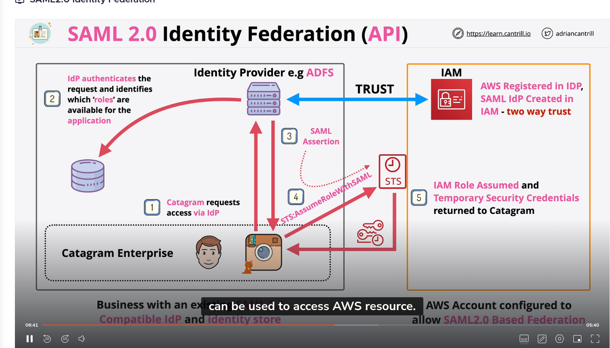

### Course AWS Accounts

- An AWS Account is a container for identities and resources.

-> unique email, and a credit card. 

Identity Center Center (Formerly AWS SSO), requires a permission set and group/user to
allow access to AWS accounts.

Management account is the account that you use to create and manage AWS Organizations.
Member accounts are the accounts that you invite to join your organization.

Payer account: Management account that pays for all the charges accrued by the member accounts.

#### Service Control Policies

Inherits permissions from the parent account.
Can be applied to OUs or accounts.

The trust policy controls who can assume the role. Conceptually this is a wall around the role.
They're valid until they expire.

Trust policy has no impact on existing credentials.

The correct way to revoke access is to apply an inline policy AWSRevokeOlderSessions to the role.

### Policy Interpretation Deep Dive.

Structure:

- Version
- Statement
    - Sid
    - Effect
    - Principal : [Required for trust policy]
    - Action
    - Resource
    - Condition

### Permission Boundaries

Applied to users or roles

### AWS Resource Access Manager( RAM)

Utilization to connect two aws accounts.
Products need to support RAM.
Shared with Principals(Accounts, OU, Orgs, etc)

You can't rely in AZ between different accounts.

### Quotas

API GATEWAY

- API Payload Size: 10MB
- Connection duration WebSocket: 7200s (2 hours)
- Custom domain names per region: 120

### Route 53

Amazon Route 53 currently supports the following DNS record types:

A (address record)
AAAA (IPv6 address record)
CNAME (canonical name record)
CAA (certification authority authorization)
MX (mail exchange record)
NAPTR (name authority pointer record)
NS (name server record)
PTR (pointer record)
SOA (start of authority record)
SPF (sender policy framework)
SRV (service locator)
TXT (text record)

### SAML 2.0

Action: sts:AssumeRoleWithSAML
another action could be: sts:AssumeRoleWithWebIdentity

### Amazon Cognito 

### Term

clickstream data: is the sequence of clicks or pages that a user follows before reaching a particular page on a website.

### Analytics on AWS

# Analytics 
- Amazon Athena: Interactive query service that makes it easy to analyze data in Amazon S3 using standard SQL.
- Amazon EMR: Managed Hadoop framework that makes it easy, fast, and cost-effective to process vast amounts of data across dynamically scalable Amazon EC2 instances.
- Amazon Redshift: Fast, simple, cost-effective data warehousing service.
- Amazon Kinesis: Platform for streaming data on AWS, offering powerful services to make it easy to load and analyze streaming data, and also providing the ability for you to build custom streaming data applications for specialized needs.
- Amazon OpenSearch Service: Highly available, scalable, and fully managed Elasticsearch service.
- Amazon QuickSight: Fast, cloud-powered business intelligence service that makes it easy to deliver insights to everyone in your organization.
- Amazon AWS Glue DataBrew: Visual data preparation tool that makes it easy for data analysts and data scientists to clean and normalize data to prepare it for analytics and machine learning.

# Data movement
- AWS Glue: Fully managed extract, transform, and load (ETL) service that makes it easy for customers to prepare and load their data for analytics.
- Amazon Managed Streaming for Apache Kafka (Amazon MSK): Fully managed service that makes it easy for you to build and run applications that use Apache Kafka to process streaming data.

### 7r in migration 

 According to the effort required to migrate, there are 7Rs:
 
- Retire: Eliminate the application and its data from the portfolio.
- Retain: Keep the application as is.
- Relocate: Mainly suitable running on VMWare or Hyper-V.
- Rehost: Lift and shift to AWS. (lift and shift)
- Replatform: Lift, tinker, and shift to AWS.
- Repurchase: (drop and shop) Drop the existing application and switch to a different product.
- Refactor: Re-architect the application to leverage cloud-native features.
