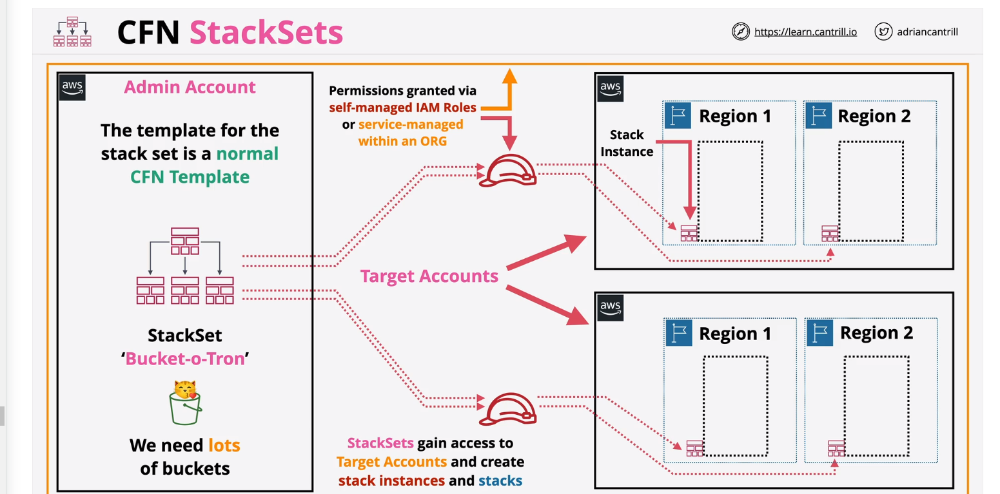

### Cloudformation

    Pseudo parameters: make available to your template, injectes
    Example: AWS::Region, AWS::AccountId, AWS::StackName, AWS::StackId

    Intrinsic functions: Ref, Fn::GetAtt, Fn::FindInMap, Fn::ImportValue, Fn::Join, Fn::Sub, Fn::Base64, Fn::Cidr, Fn::GetAZs, Fn::Select, Fn::Split, Fn::Transform, Fn::Equals, Fn::If, Fn::Not, Fn::Or, Fn::And, Fn::Condition, Fn::And, Fn::Or, Fn::Not, Fn::Equals, Fn::If, Fn::Not, Fn::Or, Fn::And, Fn::Condition, Fn::And, Fn::Or, Fn::Not, Fn::Equals, Fn::If, Fn::Not, Fn::Or, Fn::And, Fn::Condition, Fn::And, Fn::Or, Fn::Not, Fn::Equals, Fn::If, Fn::Not, Fn::Or, Fn::And, Fn::Condition, Fn::And, Fn::Or, Fn::Not, Fn::Equals, Fn::If, Fn::Not, Fn::Or, Fn::And, Fn::Condition, Fn::And, Fn::Or, Fn::Not, Fn::Equals, Fn::If, Fn::Not, Fn::Or, Fn::And, Fn::Condition, Fn::And, Fn::Or, Fn::Not, Fn::Equals, Fn::If, Fn::Not, Fn::Or, Fn::And, Fn::Condition, Fn::And, Fn::Or, Fn::Not, Fn::Equals, Fn::If, Fn::Not, Fn::Or, Fn::And, Fn::Condition, Fn::And, Fn::Or, Fn::Not, Fn::Equals, Fn::If, Fn::Not, Fn::Or, Fn::And, Fn::Condition
    

    Conditions: Fn::And, Fn::Or, Fn::Not, Fn::Equals, Fn::If, Fn::Not, Fn::Or, Fn::And, Fn::Condition

### CFN StackSet

    Deploy CFN stack across many accounts & regions 
    Are containers in an admin account.
    contain stack instances with reference stacks.

    CFN can assume a role to gain the permissions.
    The identity creating the stack, doesnt need resource permisions
    only PassRole permission to the role.

    
