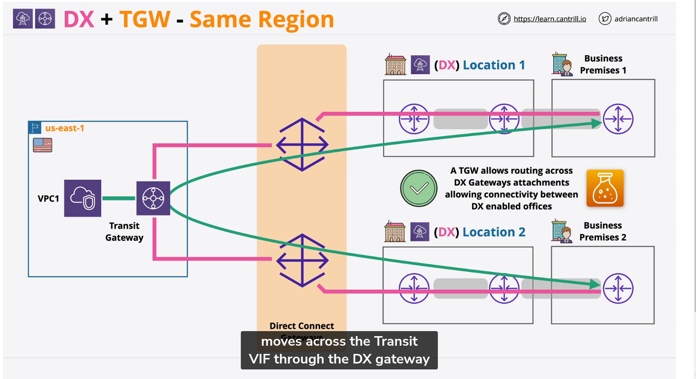

#### Networking and Hybrid 

#### DHCP in a VPC

    Dynamic Host Configuration Protocol, auto configuration for network resources.
    DHCP Options are inmutable, you can't change them after creation.
    The default DNS for AWS is route53 resolver.

    Example of public DNS: ec2-3-238-142-248.us-east-2.compute.amazonaws.com
    Example of private DNS: ip-10-0-0-10.us-east-2.compute.internal
#### VPC Router Deep Dive

    HA and Redundancy.
    Route traffic between subnets.
    Controlled using Route Tables.

    Every VPC is created with a Main route table.

#### Stateful vs Stateless firewalls

    TCP run L4
    
    Security Groups are stateful. (detects response traffic automatically(
    Network ACLs are stateless.
    The main difference is that Network ACLs have separate inbound and outbound rules, 
    while Security Groups use a single set of rules for both inbound and outbound traffic.
    
    Statefull firewall is intelligent enough to idenfity the REQUEST and RESPONSE components
    of a connection as being related.

    Allowing the REQUEST(inbound or outbound) means the respnse(inobound or outbound) is automatically allowed.

    Network Access Control List (NACL) is a stateless firewall.
    
    Custom NACL
    They have only one rule, for inbound and outbound, they deny all traffic by default.
    Only impacts data crossing subnet boundary
    Ips/CIDR,Port & Protocols, no logical resources
    NACL cannot be assigned to AWS resources, they are associated with subnets.

    
    SG are attached to ENIS.

    Capacity: 200 rules per NACL
    60 rules per SG

    NACLs are evaluated before SGs when traffic enters or leaves a subnet.

#### AWS Local Zone

    Think as single AZ, locates near your parent region

### Border Gateway Protocol (BGP)

    Autonomous System (AS) Routers controlled by one entity a network in BGP.
    
### Global Accelerator

    Global Accelerator is a networking service that sends your user’s traffic through Amazon Web Services’ global network infrastructure, improving your
    internet user performance by up to 60%.

    Moves the AWS network closer to customers.
    Connections enter at edge using anycast IP addresses.
    Transit over AWS backbone to 1+ locations.
    Can be used for NON HTTPS( TCP or UDP) traffic.

### IPSEC VPN Fundamentals

    Has two main phases: IKE phase 1 (slow) and IKE phase 2 (fast)
    IKE phase 1: Authentication and key exchange
    Using Asymmetric encryption to agree on, andcrate a shared symmetric key.

    IKE phase 2: Fast & Agile
    Uses the keys agreed in phase 1 to create a secure tunnel.
    Create IPSEC CA and IPSEC tunnel.

  Policy-based VPN
  rule sets match traffic => a pair of SAs
  different tules/security settings

  Route-based VPN
  target matching (prefix)
  matches a single pair of Sas

#### AWS Site-To-Site VPN

  VGW is HA
  VPN connection is not HA

### Static vs Dynamic VPN (BGP)

  Static: Routes for remote side added to route tables as static routes. 

  

  Dynamic: Routes for remote sided added to route table as static routes
  Route propagation

  Speed Limitation: 1.25 Gbps
  Latency: inconsistent, public internet.

  
### AWS Transit Gateway ( TGW)

  Up to 50 peering connections per TGW
  Different regions & accounts
  Data is encrypted in transit
  No route learning/propagation
  Hub and Spoke model.
  Attachments can only be associated with 1 RT.
  Attachements can propagate to many RT'S
  RT's can be associated with many attachments.

  

  Considerations:
  Support transitive routing
  Can be peer transit gateways, using AWS Resource Access Manager (RAM)
  Peer with different regions same or cross account.
  Less complex than VPC peering

  Difference between association and propagation: Association is for the attachment, propagation is for the route table.

  Check about gateway route table.
  Acceleration can be enabled when creating a TGW VPN Attachment.
  Not compatible with VPN using VGW

### AWS Direct Connect

  A physical connection between your on-premises network and AWS.(1,10,100 Gbps)
  Bussiness Premises => DX Location => AWS Region
  Port Allocation at a DX Location.
  1 or more Virtual Interfaces (VIFs) per port.
  Typos of VIF
  - Transit VIF: Access to all VPCs in a region
  - Private VIF: Access to a single VPC (Using Virtual private gateway or VGW)
  - Public VIF: Access to AWS public services (S3, DynamoDB, etc)
  
  Private VIF can only access VPC in the same AWS region via VGW.
  
  

  Public VIF: No direct to private VPC Services.
  Can access all public zones regions- across AWS Global network.
  AWS Advertise all AWS Public IP ranges to you
  

  Public VIF can't access private IP addresses.

  Private VIF: Access to a single VPC
  Using VGW
  Can access all private IP addresses

### Direct Connect Gateway

  Private VIF => DX Gateway (any region) (remember VIF is region specific)
  Associate with VGW attached to VPCs globally
  No inter-vpc routing is possible.

  Transit Gateway the way to use inter-vpc routing
  But you use Transit VIF to connect to Transit Gateway

  Direct Connect is not HA for you,but it is HA for AWS.

  Multiple physical connection act as one - speed * n.
  LAG= Link Aggregation Groups.
  

### Route53 Fundamentals

  Hosted Zones: DNS Database
  Record Sets: DNS Records
  
  Route53 Split View:
  You can use a public and private hosted zone, with the same domain name.
  
  R53 CNAME vs Alias
  "A" maps a name to an IP address
  "CNAME" maps a name to another name
  "Alias" maps a name to an AWS resource
  "MX" maps a name to a mail server
  "NS" maps a domain to the name servers
  "PTR" maps an IP to a name (reverse DNS)
  "SOA" Start of Authority, defines the zone
  "TXT" Text record, used for SPF and DKIM in email
  "SRV" Service record, defines a service endpoint
  "SPF" Sender Policy Framework, defines email sender policy
  "NAPTR" Name Authority Pointer, defines a regular expression based rewrite rule

  Simple Routing: All values are returned in a random order each record can have multiple values.There
  are no health checks.
  
  Route53 Failover Routing Policy: Active/Passive failover.
  2 record with same name, one is primary and the other is secondary.

  Multi Value Routing Policy: Multiple healthy records are returned in a random order.
  not a replacement for ELB.
  Supports multiple records with the same name and different IPs.
  
  Weighted Routing Policy: Route traffic to multiple resources in proportions that you specify.
  You can specify different health checks for different records.

  Latency Routing Policy: Route traffic based on the lowest network latency for your end user.  
  Use the same anme in each AWS region and Route53 will return the region with the lowest latency.
  You can combine with health checks. (calculate the latency between the user and the region)
  
  Geolocation Routing Policy: Route traffic based on the location of your users.

  Geoproximity Routing Policy: Route traffic based on the location of your resources and, optionally,
  shift traffic from resources in one location to resources in another. (calculate the distance between//)

  AWS PrivateLink: It is been used by Gateway Endpoints and Interface Endpoints.
  IPV4 and TCP only.

  Gateway endpoint:
  S3 and DynamoDB private access.
  Prefix List added to route table => Gateway Endpoint
  Are HA by design.
  Can have endpoint policies.
  Not accessible outside of VPC.
  

  Interface Endpoint:   
  Similar to gateway endpoint, provides private access.
  Not HA by default. Added to specific subnets. an ENI
  Controlled via Security groups.
  Can be used endpoint policies.
  TCP and IPv4
  Uses PrivateLink.
  Uses DNS and private ips

  VPC ENDPOINT POLICIES: Is a resource policy that controls access to a service endpoint.
  just control restrictions to the endpoint, not to the resource.

  DNS in VPC

  Route53 Resolver = DNS. VPC.2, .2 is also reserved in subnets.

  Route53 Endpoints are VPC interfaces- Accessible over VPN or DX.
  Inbound = on-premises can forward to R53 Resolver
  Outbound = R53 Resolver can forward to on-premises
  
  VPC IPv6
  IPV4 = 4,294,967,296
  IPV6= 340,282,366,920,938,463,463,374,607,431,768,211,456
  All IPv6 addresses are public. Nat is not used for IPv6.
  /56 for VPCs
  For IPv6 you need to use Egress-only Internet Gateway.
  
	
  Advance vpc structure subnets  
  1 tier in 3 subnet= HA
  SG= Per ENI/Resource Security  
  Differents routing destinations
  Public subnet, can have public and private instances
  Private subnet, can have only private instance.
