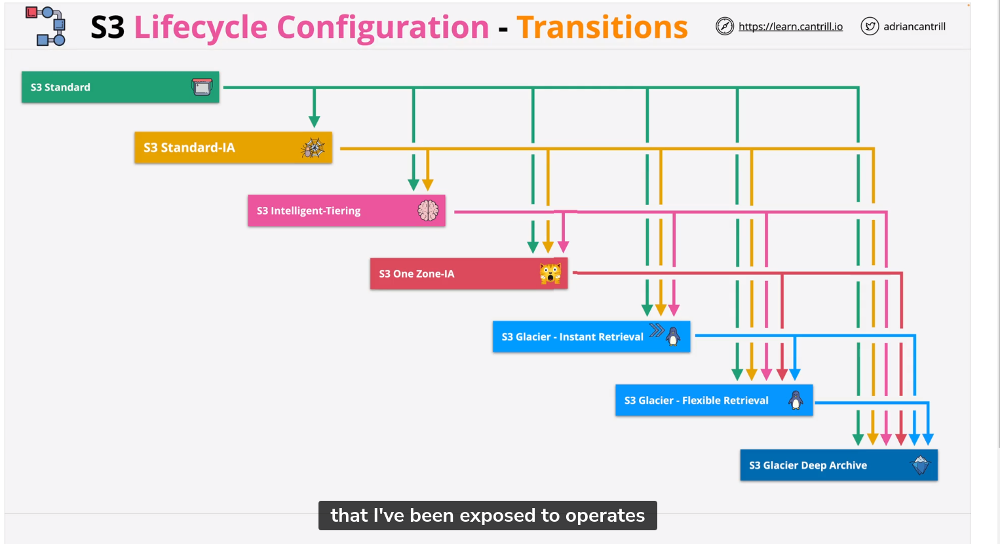

### FSx for Windows File Server

	Fully managed native windows file servers/shares
	Designed for integration with windows environments
	Integrates with Directory Services or self-managed AD
    Single or Multi-AZ within AZ
    Back-up compatible
    Can kms at reast
    Highly perfomance.
    
    
#### Fsx Key Features
   
    VSS - User driven restores
    SMB native integration.
    DFS
    Windows permissions models

### FSx for Lustre: High Performance Computing

    Machine Learning, Big Data, Financial Modelling
    100's GB/s throughput.
    Deployment types:
        - Scratch: short term storage / No HA, NO replication.
        - PERSISTENT: Long term storage (HA in one AZ)

    Accesible over VPN or Direct Connect.
    

### Efs Architecture

    Linux Only
    General Purpose or Max I/O performance modes
    Uses NFSv4.1 protocol
    Bursting and Provisioned Throughput modes
    Supports encryption at rest 
    Every mount point has a security group

### S3 Storage classes

    S3 Standard: 99.99% availability, 11 9's durability

    S3 Intelligent Tiering: 99.9% availability, 11 9's durability
    min size is 128kb

    S3 Standard-IA: 99.9% availability, 11 9's durability
    min size is 128kb
    It is important and long-lived data that is accessed less frequently, but requires rapid access when needed.

    S3 One Zone-IA: 99.5% availability, 11 9's durability
    min size is 128kb
    Is cheaper than IA, but only stores data in one AZ.

    S3 Glacier: 99.99% availability, 11 9's durability, 

    S3 Glacier Instance = for long-lived accesed once per qtr with
    millisecond latency. 128kb for min size. 90 day minimum storage duration.

    S3 Glacier Instant : 99.99% availability, 11 9's durability
    min size is 128kb

    S3 Glacier Flexible: min 90 day storage duration,
    min size is 40kb
    Expedited: 1-5 minutes
    Standard: 3-5 
    Bulk: 5-12 hours

    S3 Glacier Deep Archive: 99.99% availability, 11 9's durability
    min is 40kb

    S3 Outposts: 99.99% availability, 11 9's durability
    

### S3 - CRR( Cross-Region Replication)

    Replicate data across regions for compliance, lower latency, etc.
    Versioning must be enabled on both source and destination buckets.
    Regions must be unique.
    Files in an existing bucket are not replicated automatically.
    All subsequent updated files will be replicated automatically.
    Delete markers are not replicated.
    Deleting individual versions or delete

### S3 Replication Options

    All objects or a subset
    Storage-Class default is to maintain.
    Ownership- default is the source account. (CAREFULL ABOUT THIS! THE DESTINATION ACCOUNT COULD NOT ACCESS THE OBJECTS!)
    No system events, Glacier or Glacier Deep Archive.

    SRR - Log aggregation
    CRR - Global Resilience Improvements
    CRR - Latency Reduction

### S3 Bucket Keys

    CloudTrail KMS events now show the bucket.
    Not the object
    Works with replication, the object encryption is maintained.
    
### S3 Presigned URLS

    Uses the identity which created it.
    You can create a URL for an object you have no access to
    When using the URL, the permissions match the identity which generated it.
    Access denied could mean the generating ID never had access or doesn´t now.
    Don't generate with a role. URL stops working when temporary credentials expire.

### S3 Select and Glacier Select

    A way to retrieve objects, using SQL queries.
    Works with CSV, JSON, Parquet files, BZIP2 

### S3 Access Points

    Simplify managing access to S3 Bucketrs/Objects
    Many access point per bucket
    
### S3 Object Lock
    
    Can only be enabled for new buckets. 
    Write Once Read Many (WORM),NO DELETE, NO OVERWRITE
    Requires versioning enabled on the bucket.
    1- Retention Period
        - Compliance : Can't be overwritten or deleted for a specified period of time.
        - Governance: Special permissions can be granted allowing lock settings to be adjusted.

    2- Legal Hold
        No retention, No deletes or changes until removed.
        s3:PutObjectLegalHold is required to add or remove.

### Amazon Macie

    Uses ML to discover, classify and protect sensitive data.
    Uses CloudTrail, CloudWatch Events, CloudWatch Logs, VPC Flow Logs, S3 Logs, AWS Config, and more.
    Uses mutli-account structures.
    Reacting with S3.

### EBS Volume Types

    GP2 = SSD 
    Up to 16,000 IOPS per volume.
    Up to 250 MB/s per volume.
    GP3 = 
    Up to 16,000 IOPS per volume.
    Up to 1,000 MB/s per volume.

    Provisioned IOPS= can be adjusted independently from volume size.
    Up to 64,000 IOPS per volume.
    Up to 1,000 MB/s per volume.
    Block Express: Up to 256,000 IOPS per volume.
    Up to 4,000 MB/s per volume.

### Instance Store Volume

    Attached at launch time.
    Local on EC2 Host
    Lost on instance, move, resize, or hadrware failure 
    High Performance
    
### Choosing between Instance Store and EBS.

    Persistance = EBS (avoid instance store)
    Resilience = EBS (avoid instance store)
    
### Transfer Family

    Supports transferring TO or FROM S3 and EFS
    FTP, FTPS, SFTP, AS2, MFTW
    Multi AZ

### Placement groups

    Cluster: Pack instances close together  : low latency
    Spread keep instances separated : critical instances
    Partition: groups of instances spread apart : large distributed and replicated workloads

    Partiion placement groups
    Instances can be placed in a specific partition.
    7 partitions per AZ
    HDFS,HBASE and Cassandra
    Own racks and network switches.
    You can launch many instances in a partition.

    

    

    

