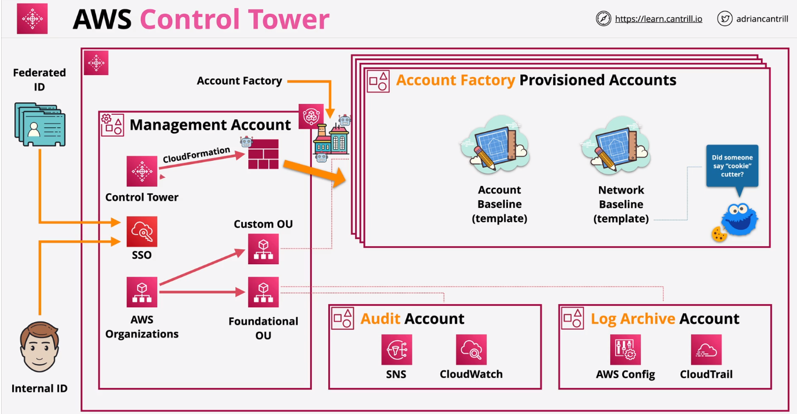

#### Amazon Workspaces

- Customers connect via Workspaces Client App using shared gateways
- Workspaces and directory services run in AWS managed VPC and uses ENis
- Can be used for Windows and Linux.
- No HA.

#### Microsoft AD

- Native Microsoft Active Directory 2012 R2.
- Managed using Standard Active Directory tools.
- Support Group Policy and SSO.
- Support Schema extension MS AD Aware Apps.
- Two sizes: 30k and 50k objects.
- Support RADIUS-based MFA.
- Can work even if a network connection to AWS is not available.

#### AD Connector
- A Pair of directory endpoint running in AWS( Enis in a VPC)
- Redirects requests to existing directory servers
- No directory data stored in AWS...all redirected
- Use existing on-premises AD with directory compatbile AWS Services- without any identity data
in AWS.
- Multiple AD Connectors can be deployed to spread load and for HA.
- Requires 2 subnets in different AZs.
- Connector requires 1 or more directory servers to be configured.
- Network connectivity via Direct Connect or VPN.

#### AWS Control Tower

- Automates the set up of a baseline environment, or landing zone, that is a secure, well-architected, multi-account AWS environment.

